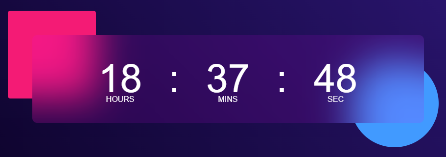

# Digital Clock README

Welcome to the Digital Clock project repository! This web application is a simple yet elegant digital clock created using HTML, CSS, and JavaScript. It provides users with a clear and accurate display of the current time.

## Table of Contents
- [Introduction](#introduction)
- [Features](#features)
- [Installation](#installation)
- [Usage](#usage)
- [Technologies Used](#technologies-used)
- [Screenshots](#screenshots)
- [Contributing](#contributing)
- [License](#license)

## Introduction
The Digital Clock is a project developed by Thembi as part of my journey in upskilling in web development. It offers a stylish and functional way for users to keep track of time while exploring my coding skills.

## Features
- **Real-Time Display:** The clock provides an accurate display of the current time.
- **Stylish Design:** The design is minimalistic and visually appealing.
- **24-Hour Format:** Time is displayed in the 24-hour format for precision.

## Installation
To run the Digital Clock locally, follow these steps:

1. Clone this repository:
   ```
   git clone https://github.com/ngww/digital-clock.git
   ```

2. Navigate to the project directory:
   ```
   cd digital-clock
   ```

3. Open the `index.html` file in your preferred web browser.

## Usage
1. Open the app in your browser.
2. The digital clock will display the current time in the 24-hour format.
3. You can leave it running as a real-time clock on your desktop or project it on a bigger screen if desired.

## Technologies Used
- HTML5
- CSS3
- JavaScript

## Screenshots
[Live Demo](https://digital-clock-ngww.vercel.app)


## Contributing
Contributions to the Digital Clock project are welcome! If you have ideas for new features or improvements, please feel free to create a pull request. Ensure that your contributions align with the project's goals.

## License
This project is licensed under the [MIT License](LICENSE).

---

Thank you for exploring the Digital Clock! It's a practical and aesthetically pleasing way to display the current time. If you have any questions or suggestions, feel free to contact me via twitter at @ngwcodes. Enjoy using the digital clock!